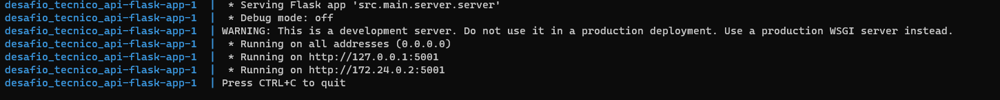
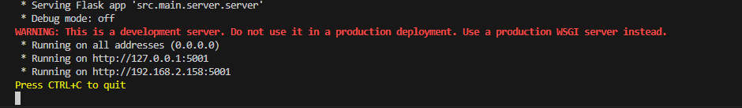
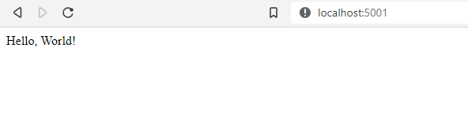

# Desafio Técnico API
Repositório destido à construção da API do desafio técnico. Abaixo estão as instruções para rodar o projeto.

## Instalação

1. Clonar o repositório

```
    git clone https://github.com/Pedro-V8/desafio_tecnico_api.git
```

2. Entrar no diretório

```
   cd desafio_tecnico_api/
```

3. Criar um arquivo .env e adicionar os seguintes dados

```
ENGINE=mysql+pymysql
USER=pedrovieira
PASS=cGVkcm92aWVp
HOST=jobs.visie.com.br
PORT=3306
DB=pedrovieira
```


4.  Rodar o projeto com docker-compose

```
   docker-compose up --build
```

- Após o build e o container estiver rodando deverá aparecer o log abaixo:



5. Outra alternativa sem usar o docker seria utiliando o venv do python

    5.1 Instanciar uma venv do python
    ```
        python3 -m venv venv
    ```

    5.2 Ativar a venv
    ```
        .\venv\Scripts\activate  --> Windows

        source venv\bin\activate  --> Linux/MacOS
    ```

    5.3 Instalar as dependências:
    ```
        pip3 install -r requirements.txt
    ```

    5.4 Rodar o projeto:
    ```
        python run.py
    ```

    - Saída esperada:

    

6. Para testar se a API está rodando corretamente acessar http://localhost:5001/

- Resultado esperado:



